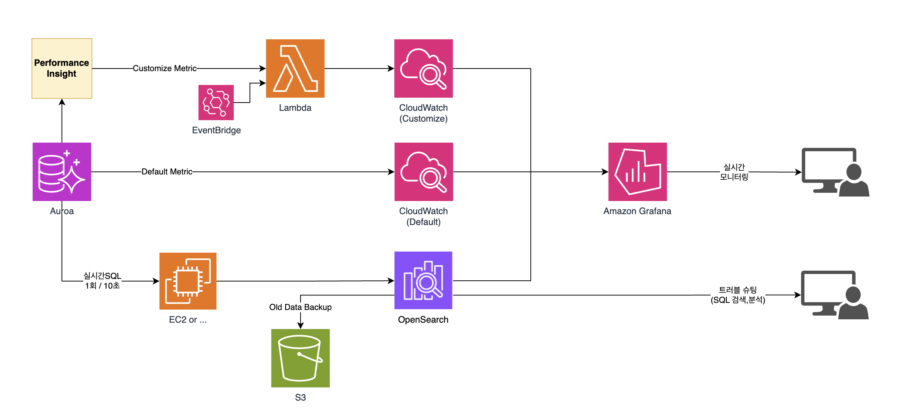
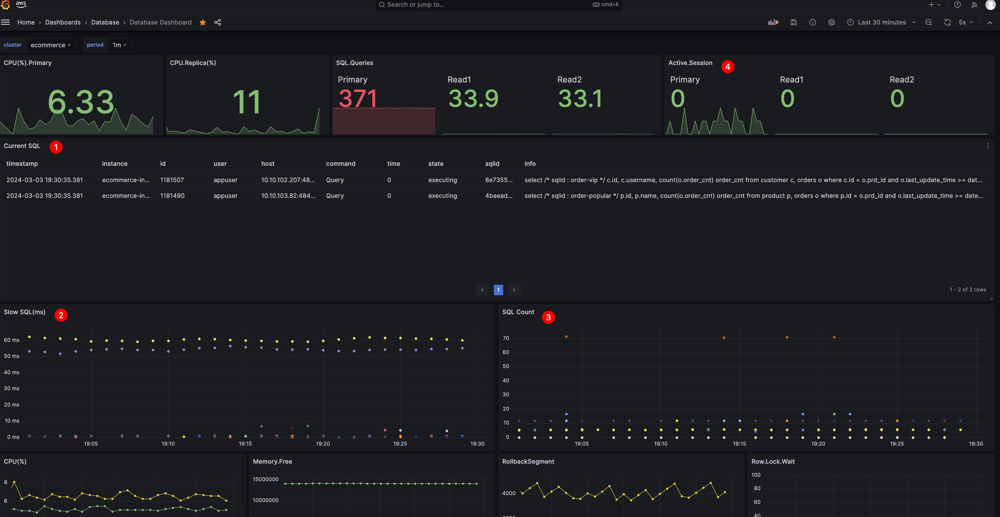
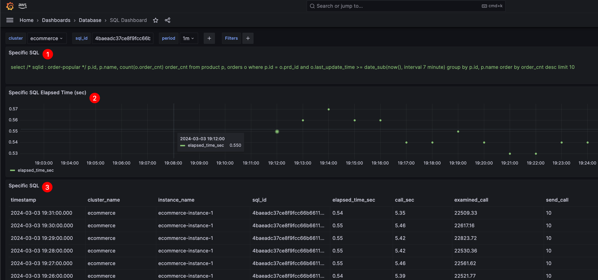
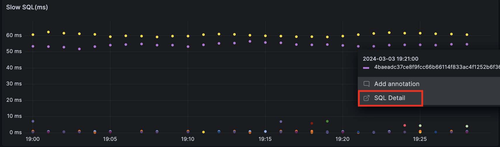
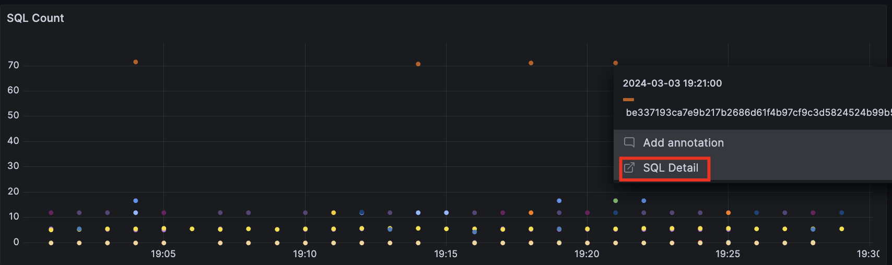

### Goal
- Remove commercial monitoring
- Add/Delete monitoring based on RDS tags
- Grouping by RDS cluster units
- Customize metrics
- Real-time SQL view
- Slow SQL metrics
- SQL history analysis

### Architecture

### Dashboard Overview
1. Real-time SQL Monitoring
2. Slow SQL Monitoring
3. SQL COUNT Monitoring
4. Metric Customization
   

### Specific SQL 
1. Specific SQL Full Text
2. Specific Slow SQL Metric
3. Specific SQL History

### Slow SQL

### SQL Count
